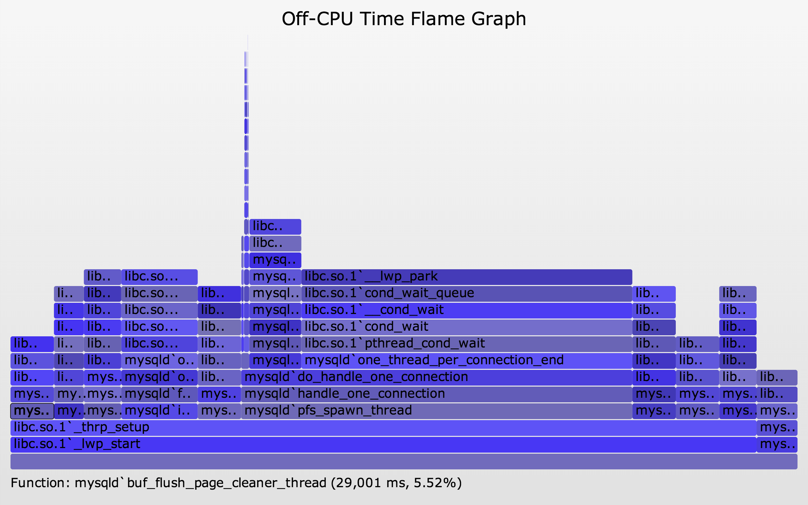
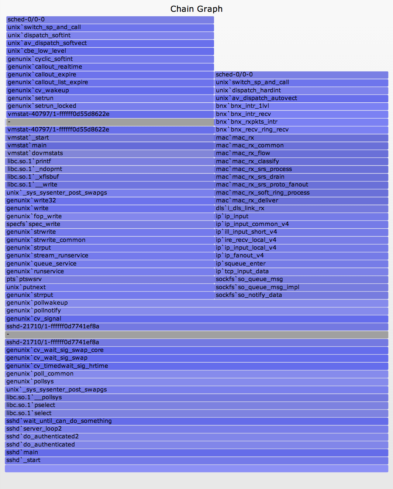

# Off-CPU Flame Graphs
使用`OFF-CPU火焰图`，用户可以分析定位阻塞在IO、阻塞在锁等待、内存swap上的问题。下面根据不同的问题分别说明。

同时可以使用春哥的[nginx-systemtap-toolkit](https://github.com/openresty/nginx-systemtap-toolkit#sample-bt-off-cpu)

## I/O
如果是同步IO，IO的延时会导致程序的延时。如果是异步IO，IO的延时可能不会直接导致程序的问题。

下面是一个例子，追踪ZFS上的系统操作。首先使用DTrace脚本(zfsustacks.d)采集数据，脚本内容为：
```
#!/usr/sbin/dtrace -s

#pragma D option quiet
#pragma D option ustackframes=100

fbt::zfs_read:entry, fbt::zfs_write:entry, fbt::zfs_readdir:entry,
fbt::zfs_getattr:entry, fbt::zfs_setattr:entry
{
	self->start = timestamp;
}

fbt::zfs_read:return, fbt::zfs_write:return, fbt::zfs_readdir:return,
fbt::zfs_getattr:return, fbt::zfs_setattr:return
/self->start/
{
	this->time = timestamp - self->start;
	@[ustack(), execname] = sum(this->time);
	self->start = 0;
}

dtrace:::END
{
	printa("%k%s\n%@d\n", @);
}
```
这个脚本会内核VFS/ZFS层的逻辑IO接口，例如zfs_read(), zfs_write(), ...。这个脚本会输出用户空间的栈、进程名、IO延时等。
生成火焰图的步骤为：
```
# ./zfsustacks.d -n 'tick-10s { exit(0); }' -o out.iostacks

# stackcollapse.pl out.iostacks | awk '{ print $1, $2 / 1000000 }' | \
    flamegraph.pl --title="FS I/O Time Flame Graph" --color=io \
    --countname=ms --width=500 > out.iostacks.svg
```

## Off-CPU
先使用DTrace收集数据：
```
# dtrace -x ustackframes=100 -n '
    sched:::off-cpu /execname == "bash"/ { self->ts = timestamp; }
    sched:::on-cpu /self->ts/ {
    @[ustack()] = sum(timestamp - self->ts); self->ts = 0; }
    tick-30s { exit(0); }' -o out.offcpu
```
该命令监控内核调度，当线程被调度让出CPU时，记录一个时间戳，当线程再次占用CPU时，再记录一个时间戳，然后计算出该线程让出CPU的总时间。
然后用采集的数据生成图，单位纳秒：
```
# stackcollapse.pl < out.offcpu | awk '{ print $1, $2 / 1000000 }' | \
    flamegraph.pl --title="Off-CPU Time Flame Graph" --color=io \
    --countname=ms --width=600 > out.offcpu.svg
```
生成的图标


- 图中每一列代表个线程

## Wakeup
有时只有`off-cpu`图无法断定进程阻塞的原因，这时需要结合`wakeup`图才能找到真正阻塞的原因。
采集`wakeup`数据可以采用以下脚本：
```
#!/usr/sbin/dtrace -s

#pragma D option quiet
#pragma D option ustackframes=100
#pragma D option stackframes=100
int related[uint64_t];

sched:::sleep
/execname == "sshd" || execname == "vmstat"/
{
	ts[curlwpsinfo->pr_addr] = timestamp;
}

sched:::wakeup
/ts[args[0]->pr_addr]/
{
	this->d = timestamp - ts[args[0]->pr_addr];
	@[args[1]->pr_fname, args[1]->pr_pid, args[0]->pr_lwpid, args[0]->pr_wchan,
	    stack(), ustack(), execname, pid, curlwpsinfo->pr_lwpid] = sum(this->d);
	ts[args[0]->pr_addr] = 0;
}

dtrace:::END
{
	printa("\n%s-%d/%d-%x%k-%k%s-%d/%d\n%@d\n", @);
}
```
可以通过`wakeup`图发现`off-cpu`图上阻塞的线程是被哪些线程唤醒的，从而发现他们之间的调度关系，对照2张图可以发现调度上的问题。

## Chain Graph
`Chain Graph`是将`off-cpu`图和`wakeup`图合并在一张图上，然后将`wakeup`图的栈点到，按照线程对接起来，在分界线加入一行灰色的行。多个`wakeup`栈之间也由灰色间隔。这样可以很明确看到他们之间的调度关系。

