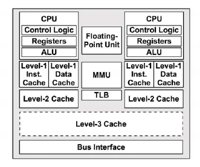
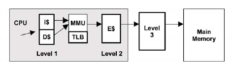

# perf stat 命令用于统计进程总体的信息
面对一个问题程序，最好采用自顶向下的策略。先整体看看该程序运行时各种统计事件的大概，再针对某些方向深入细节。而不要一下子扎进琐碎细节，会一叶障目的。

## SYNOPSIS
```
      perf stat [-e <EVENT> | --event=EVENT] [-a] <command>
      perf stat [-e <EVENT> | --event=EVENT] [-a] — <command> [<options>]
```
## OPTIONS
```
    <command>...
      Any command you can specify in a shell.
      当你需要对某个命令或程序执行perf stat时，将该命令附在perf stat后面，例如对ls命令进行统计: perf stat ls
      通常是对某个进程进行统计，使用-p参数

    -e, --event=
      Select the PMU event. Selection can be a symbolic event name (use perf list to list all events) or a
      raw PMU event (eventsel+umask) in the form of rNNN where NNN is a hexadecimal event descriptor.
      当需要只测量某些event时，可以使用-e指定该event，可以通过perf list来查询支持的event.

    -i, --no-inherit
      child tasks do not inherit counters
      子进程、线程是否继承计数

    -p, --pid=<pid>
      stat events on existing process id (comma separated list)
      指定被测量进程的pid

    -t, --tid=<tid>
      stat events on existing thread id (comma separated list)
      指定被测量线程的tid

    -a, --all-cpus
      system-wide collection from all CPUs
      重所有CPU收集数据，如果没有-A参数时，会自动将各个CPU的数据进行聚合。

    -c, --scale
      scale/normalize counter values

    -r, --repeat=<n>
      repeat command and print average + stddev (max: 100). 0 means forever.
      重复执行命令多少次

    -B, --big-num
      print large numbers with thousands' separators according to locale

    -C, --cpu=
      Count only on the list of CPUs provided. Multiple CPUs can be provided as a comma-separated list with
      no space: 0,1. Ranges of CPUs are specified with -: 0-2. In per-thread mode, this option is ignored.
      The -a option is still necessary to activate system-wide monitoring. Default is to count on all CPUs.
      统计指定的CPU数据

    -A, --no-aggr
      Do not aggregate counts across all monitored CPUs in system-wide mode (-a). This option is only valid
      in system-wide mode.
      在-a模式下，-A参数指定不聚合最后数据。

    -n, --null
      null run - don’t start any counters
      空跑，不输出任何数据

    -v, --verbose
      be more verbose (show counter open errors, etc)

    -x SEP, --field-separator SEP
      print counts using a CSV-style output to make it easy to import directly into spreadsheets. Columns
      are separated by the string specified in SEP.
      指定数据数据的分割符个数

    -G name, --cgroup name
      monitor only in the container (cgroup) called "name". This option is available only in per-cpu mode.
      The cgroup filesystem must be mounted. All threads belonging to container "name" are monitored when
      they run on the monitored CPUs. Multiple cgroups can be provided. Each cgroup is applied to the
      corresponding event, i.e., first cgroup to first event, second cgroup to second event and so on. It
      is possible to provide an empty cgroup (monitor all the time) using, e.g., -G foo,,bar. Cgroups must
      have corresponding events, i.e., they always refer to events defined earlier on the command line.
      指定cgroup名称

    -o file, --output file
      Print the output into the designated file.
      指定输出文件名

    --append
      Append to the output file designated with the -o option. Ignored if -o is not specified.
      输出模式采用追加模式

    --log-fd
      Log output to fd, instead of stderr. Complementary to --output, and mutually exclusive with it.
      --append may be used here. Examples: 3>results perf stat --log-fd 3  — $cmd 3>>results perf stat
      --log-fd 3 --append — $cmd

      --pre, --post
        Pre and post measurement hooks, e.g.:
          perf stat --repeat 10 --null --sync --pre make -s O=defconfig-build/clean — make -s -j64
          O=defconfig-build/ bzImage
          --pre指定在计数器启动之前运行的命令，--post指定在计数器关闭后运行的命令

      -I msecs, --interval-print msecs
        Print count deltas every N milliseconds (minimum: 100ms) example: perf stat -I 1000 -e cycles -a
        sleep 5
        指定每隔多少毫秒输出一次数据

      --per-socket
        Aggregate counts per processor socket for system-wide mode measurements. This is a useful mode to
        detect imbalance between sockets. To enable this mode, use --per-socket in addition to -a.
        (system-wide). The output includes the socket number and the number of online processors on that
        socket. This is useful to gauge the amount of aggregation.

      --per-core
        Aggregate counts per physical processor for system-wide mode measurements. This is a useful mode to
        detect imbalance between physical cores. To enable this mode, use --per-core in addition to -a.
        (system-wide). The output includes the core number and the number of online logical processors on
        that physical processor.

      -D msecs, --delay msecs
        After starting the program, wait msecs before measuring. This is useful to filter out the startup
        phase of the program, which is often very different.
        指定在启动程序后，延时多少毫秒才开始统计

      -T, --transaction
        Print statistics of transactional execution if supported.
        需要CPU支持，e.g., https://software.intel.com/en-us/blogs/2013/05/03/intelr-transactional-synchronization-extensions-intelr-tsx-profiling-with-linux-0
```
当执行perf stat(`perf stat -p 32188 -a`)统计一个进程的数据后，会得到以下输出：
```
   9874.289162      task-clock (msec)         #    2.310 CPUs utilized           [100.00%]
       114,900      context-switches          #    0.012 M/sec                   [100.00%]
         4,423      cpu-migrations            #    0.448 K/sec                   [100.00%]
        48,182      page-faults               #    0.005 M/sec
19,339,604,099      cycles                    #    1.959 GHz                     [83.26%]
13,776,892,410      stalled-cycles-frontend   #   71.24% frontend cycles idle    [83.77%]
 6,904,668,317      stalled-cycles-backend    #   35.70% backend  cycles idle    [66.73%]
13,154,547,754      instructions              #    0.68  insns per cycle
                                              #    1.05  stalled cycles per insn [83.45%]
 2,637,409,665      branches                  #  267.099 M/sec                   [83.28%]
    64,139,005      branch-misses             #    2.43% of all branches         [82.99%]

4.275325044 seconds time elapsed
```
- `task-clock` 任务真正占用的处理器时间，单位为ms。CPUs utilized = task-clock / time elapsed，CPU的占用率，值高，说明程序的多数时间花费在CPU计算上而非IO。
- `context-switches` 上下文的切换次数。
- `CPU-migrations` 处理器迁移次数。Linux为了维持多个处理器的负载均衡，在特定条件下会将某个任务从一个CPU迁移到另一个CPU。这里要注意下CPU迁移和上下文切换的不同之处：发生上下文切换时不一定会发生CPU迁移，而发生CPU迁移时肯定会发生上下文切换。发生上下文切换时有可能只是把上下文从当前CPU中换出，下一次调度器还是将进程安排在这个CPU上执行。
- `page-faults` 缺页异常的次数。当应用程序请求的页面尚未建立、请求的页面不在内存中，或者请求的页面虽然在内存中，但物理地址和虚拟地址的映射关系尚未建立时，都会触发一次缺页异常。另外TLB不命中，页面访问权限不匹配等情况也会触发缺页异常。
- `cycles` 消耗的处理器周期数。
- `instructions` 执行了多少条指令。IPC为平均每个cpu cycle执行了多少条。IPC：是 Instructions/Cycles 的比值，该值越大越好，说明程序充分利用了处理器的特性。这是整个perf stat命令输出中最重要的指标值。第二列中的`insns per cycle`，简称IPC，表示一个时钟周期内能完成多少个CPU指令。该值越高，表示CPU的性能越好。第二行的`stalled cycles per insn`，表示完成每个指令，有多少个时钟周期是被停滞的，这个值越小，表示CPU的性能越好。该值是由`stalled-cycles-frontend`除以instructions得到的。
- `branches` 遇到的分支指令数。
- `branch-misses` 预测错误的分支指令数。
- `cache-misses` 程序运行过程中总体的 cache 利用情况，如果该值过高，说明程序的 cache 利用不好.
- `stalled-cycles` 字面意义是停滞周期，先介绍下`instruction pipeline`(姑且翻译为指令管道)：指令管道是一种可以并行执行多个指令的CPU架构，通过同时执行不同的指令的不同组合实现。这类似于工厂的组装线，产品的不同阶段可以并行执行以提高吞吐量。考虑前面提到的指令步骤，如果每个步骤需要一个时钟周期，该指令则需要五个时钟周期来完成执行。在这个指令的每个单独的步骤中，只有一个功能单元是运行的，而其他四个是空闲的。通过使用指令管道，多个功能单元可以在同一时间运行，在管道中处理不同的指令。在理想状态下，处理器可以在一个时钟周期中完成一个指令。而`stalled-cycles`，则是指令管道未能按理想状态发挥并行作用，发生停滞的时钟周期。`stalled-cycles-frontend`指指令读取或解码的指令步骤，而`stalled-cycles-backend`则是指令执行步骤。第二列中的`cycles idle`其实意思跟`stalled`是一样的，由于指令执行停滞了，所以指令管道也就空闲了，千万不要误解为CPU的空闲率。这个数值是由`stalled-cycles-frontend`或`stalled-cycles-backend`除以上面的`cycles`得出的。
- `L1-dcache-loads` 一级数据缓存读取次数。
- `L1-dcache-load-missed` 一级数据缓存读取失败次数。
- `LLC-loads` last level cache读取次数。
- `LLC-load-misses` last level cache读取失败次数。

要理解CPU缓存是什么，需要先了解下CPU的缓存架构，如下图：



1. `level-1 data cache`：一级数据缓存(I$)
2. `level-1 inst cache`：一级指令缓存(D$)
3. `MMU`：内存管理单元
4. `TLB`：转换后援缓存(translation lookaside buffer)
5. `level-2 cache`：二级缓存(E$)
6. `level-3 cache`：三级缓存
处理器读取数据过程如下面两个图：



1. CPU根据虚拟地址尝试从一级缓存(存放的是虚拟地址的索引)中读取数据；
2. 如果一级缓存中查找不到，则需向MMU请求数据；
3. MMU从TLB中查找虚拟地址的缓存(换言之，TLB是负责改进虚拟地址到物理地址转换速度、存放虚拟地址的缓存)；
4. 如果TLB中存在该虚拟地址的缓存，则MMU将该虚拟地址转化为物理地址，如果地址转换失败，则发生缺页(图中的fault分支)，由内核进行处理，见上文所述；如果地址转换成功，则从二级缓存(存放的是物理地址的索引)中读取；如果二级缓存中也没有，则需要从三级缓存甚至物理内存中请求；
5. 如果TLB中不存在该虚拟地址的缓存，则MMU从物理内存中的转换表(translation tables，也称为页表page tables)中获取，同时存入TLB；(注意，这个操作是硬件实现的，可以由MMU通过硬件直接从物理内存中读取)；
6. 跳到第4步。
由此可见，`L1-dcache-load-missed`和`LLC-load-misses`的数值当然是越低越好了。


统计命令：
`perf stat -e cycles,instructions,L1-dcache-loads,L1-dcache-load-misses,LLC-loads,LLC-load-misses,dTLB-loads,dTLB-load-misses -p 32188 sleep 10`

此处可以参考 [perf stat 输出解读](http://zhengheng.me/2015/11/12/perf-stat/)
